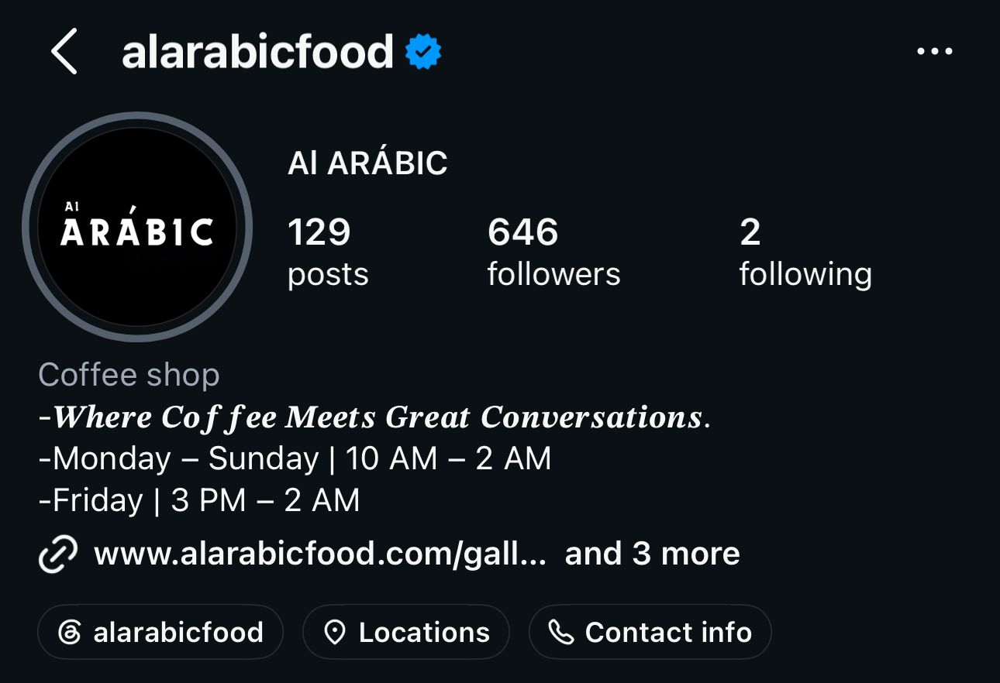
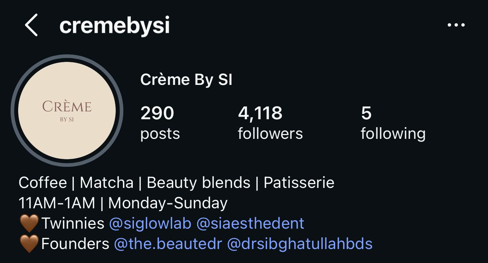
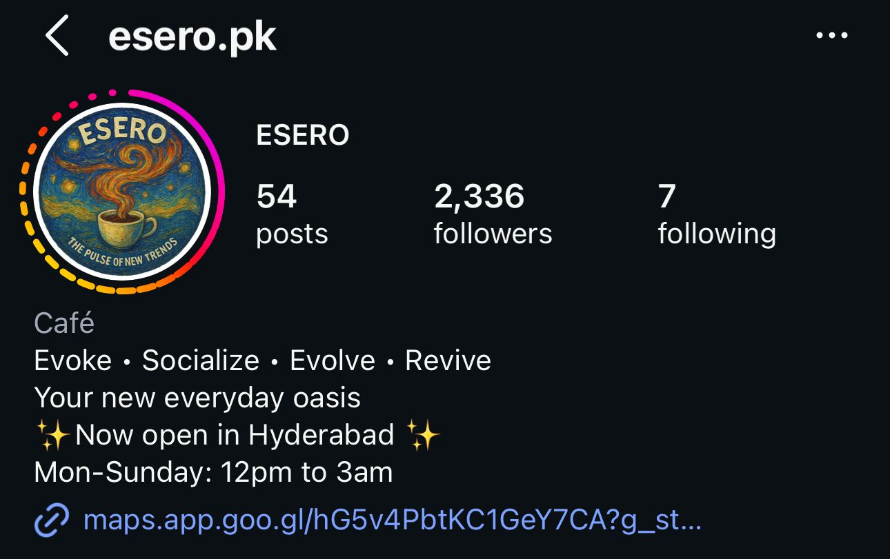
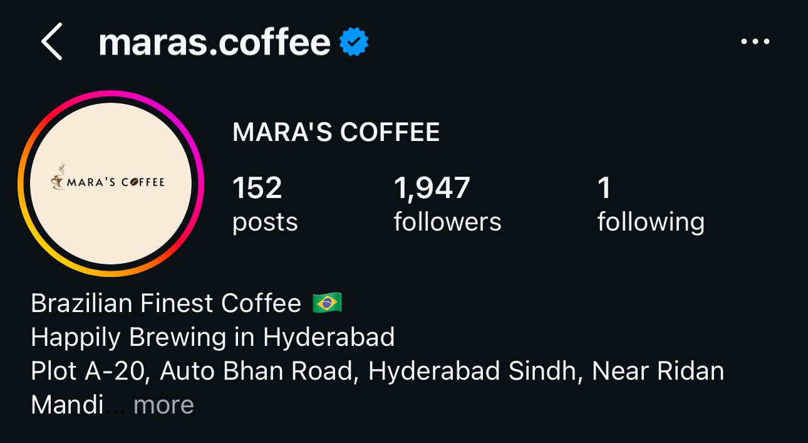
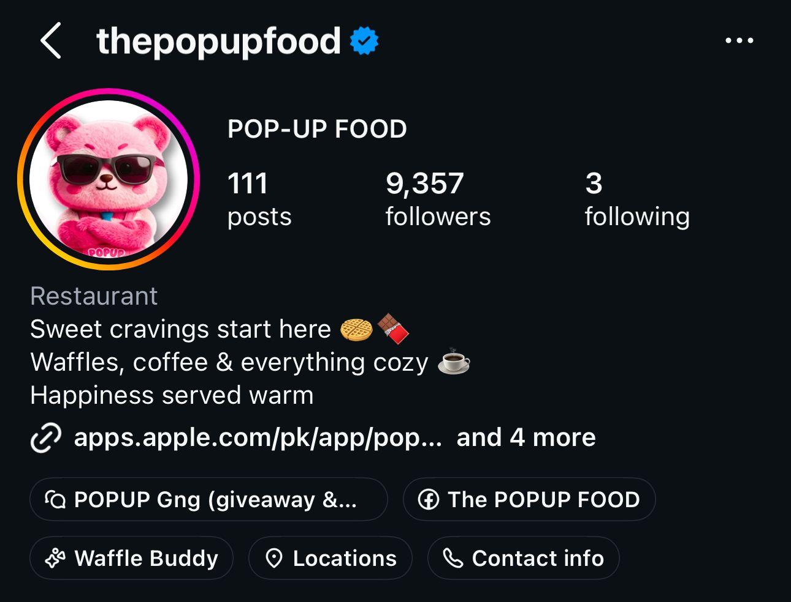

# Al Arabic Coffee Social Media Growth Strategy

# About This Project

I created this project to analyze the social media presence of Al Arabic Coffee and explore ways the brand could grow its online audience.

While Al Arabic Coffee is known by many coffee lovers in Hyderabad, it does not seem to have the same level of online visibility as competitors such as Mara’s Coffee and Crème. This project looks at what those competitors are doing well and suggests strategies that could help Al Arabic Coffee increase engagement and reach more potential customers.

# Disclaimer

This is an independent portfolio project created for learning and professional development purposes. I am not affiliated with or employed by Al Arabic Coffee.

# Why I Chose This Business

I chose Al Arabic Coffee because I believe it has strong potential but is currently underrepresented online. After comparing its social media presence with other local cafés, I noticed several opportunities to improve visibility, strengthen customer engagement, and better showcase the brand’s unique identity.

# What This Project Includes

* A competitor analysis comparing Al Arabic Coffee with local competitors
* A sample content calendar
* Content ideas designed to increase engagement
* Recommendations for improving social media performance

## Key Findings

After reviewing Al Arabic Coffee and its competitors, several opportunities for growth were identified:

- Competitors post more consistently
- Reels receive higher engagement than static posts
- Interactive stories are used more frequently by competitors
- Trend-driven and Gen Z-focused content appears to attract more engagement
- Al Arabic Coffee has strong products but lower online visibility

# Recommendations

Some ideas that could help improve engagement include:

* Posting more consistently throughout the week
* Creating reels using Gen-Z humor, trending sounds 
* Sharing customer experiences and reviews
* Using polls, questions, and other interactive story features

# Skills Demonstrated

# Through this project, I practiced:

* Social media analysis
* Competitor research
* Content planning
* Strategic thinking
* Data organization and presentation

# Project Goal

The goal of this project is not to criticize the business, but to explore practical ways its social media presence could be strengthened and to demonstrate my ability to analyze a brand and develop actionable recommendations.

## Competitor Screenshots

### Al Arabic Foods

### Crème by SI

### Esero

### Mara's Coffee

### Pop Up Food

